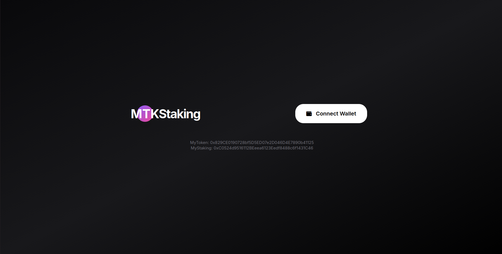
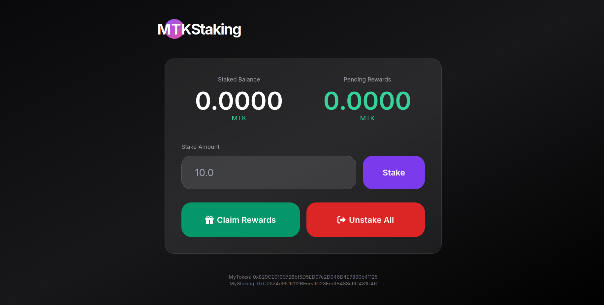

# MTK Staking - Modern ERC20 Staking DeFi App

A clean, aesthetic and fully functional staking platform built with React + Vite.



## ✨ Features

- Connect Wallet with RainbowKit
- Real-time Staked Balance & Pending Rewards
- Stake MTK tokens
- Claim Rewards
- Unstake All + Claim in one click
- Beautiful glassmorphic dark UI
- Deployed on **Sepolia Testnet**



## Contract Addresses (Sepolia Testnet)

| Contract      | Address                                            |
|---------------|----------------------------------------------------|
| **MyToken**   | `0x829CE0190728bf5D5ED07e2D046D4E7890b41125`      |
| **MyStaking** | `0xC0524d9516112BEeea6123Eedf8488c6f1431C46`      |

## Tech Stack

- **Frontend**: React + Vite + TypeScript + Tailwind CSS
- **Web3**: Wagmi v2 + Viem + RainbowKit
- **Smart Contracts**: Solidity 0.8.20 + Foundry
- **UI**: Glassmorphism + Modern Dark Theme

## How to Run Locally

```bash
cd frontend
npm install
npm run dev
Open http://localhost:5173
Project Structure
textmtk-staking/
├── contracts/          # Solidity smart contracts
├── frontend/           # React + Vite frontend
└── README.md

Made with ❤️ for learning & portfolio
Last Updated: April 30, 2026
EOF
text---

### How to use it:

1. Take two screenshots of your app:
   - `screenshot-1.png` → Main page with Connect Wallet button
   - `screenshot-2.png` → Dashboard after connecting wallet

2. Put both images in the root folder (`~/mtk-staking/`)

3. Run the command above.

Your README will now look very professional and impressive on GitHub.

Would you like me to also create a nice banner image or add more sections? Just say.
# MTK Staking - Beautiful ERC20 Staking dApp

Modern, secure, and aesthetic staking platform built with **Foundry + Next.js 15 + Wagmi + RainbowKit**.


## ✨ Features

- Clean single-pool staking
- Real-time reward calculation
- Approval handling (one-click)
- Responsive glassmorphic UI
- Pause / Emergency controls
- Fully audited-ready contracts

## Tech Stack

**Contracts**: Solidity 0.8.20 + Foundry  
**Frontend**: Next.js 15 + TypeScript + Tailwind + shadcn/ui + RainbowKit  
**Web3**: wagmi + viem

## Quick Start

```bash
# 1. Clone
git clone https://github.com/yourusername/mtk-staking.git
cd mtk-staking

# 2. Deploy Contracts
cd contracts
cp .env.example .env
forge install
forge script script/Deploy.s.sol --rpc-url https://rpc.sepolia.org --broadcast --verify

# 3. Run Frontend
cd ../frontend
cp .env.example .env.local
npm install
npm run dev
